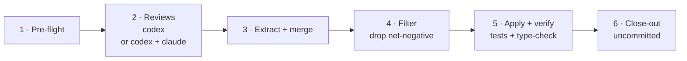

# 🔍 iso-review

> Review your **uncommitted working tree** with Codex only or with Codex + Claude — merge findings, apply every fix that helps, verify, and stop uncommitted for your final read.

---

## 🧩 What It Does

Review of the current working-tree diff, then applies the fixes worth keeping — never committing.

- 👥 **Review tabs** — Codex reviews the diff; Claude is included by default and skipped with `--codex-only`
- 🔀 **Merged + de-duplicated** — findings hitting the same spot fold into one (noting both reviewers raised it)
- ✅ **Keeps almost everything** — applies every fix except the net-negative ones (over-engineering, speculative "consider…" notes, coupling/churn for no real gain)
- 🧪 **Self-verifies** — a fix tab (codex by default, claude via `--fix-agent`, or an existing tab via `--fix-term`) applies the fixes, then runs the repo's tests + type-check and reports
- 🛑 **Never commits** — leaves all changes in the working tree for your final read

---

### Flow

The main session orchestrates; the review and fix tabs do the work. One review at a time per working tree — for parallel reviews, use separate git worktrees (each gets its own cwd-local `.iso/logs/review`).



`.iso/logs/review` is wiped clean at the start of each run, so no prior run's findings, transcripts, or accepted fixes leak in.

---

## ▶️ Trigger

```
/iso-review
```

Or ask: *"review and fix my uncommitted changes with codex only"*

### Flags

| Flag | Effect |
|------|--------|
| `--codex-only` | Run only the Codex reviewer; no Claude tab is spawned |
| `--claude-review-effort high\|max` | Effort level for the claude reviewer (default `high`). `--max` is shorthand for `max` |
| `--fix-agent codex\|claude` | Which agent drives a newly spawned fix tab (default `codex`; ignored with `--fix-term`) |
| `--fix-term TERM` | Reuse an existing live agent tab for fixes instead of spawning a new fix tab |
| `--kill-review-tabs` | Tear down both review tabs once their findings are saved to disk |
| `--kill-fix-tab` | Tear down the fix tab once its test/type report is captured |
| `--kill-tabs` | Shorthand for both kill flags |

```
/iso-review --codex-only
/iso-review --claude-review-effort max
/iso-review --fix-agent claude
/iso-review --fix-term term_IMPL
/iso-review --kill-tabs
```

The default reviewers are codex + claude. Use `--codex-only` when Claude tokens are unavailable. Only the claude reviewer's **effort** and the **fixer** are selectable.

Teardown is **opt-in** — by default every tab stays alive for inspection. Each kill happens only *after* that tab's output is on disk, so it reclaims the process without losing anything you read.

---

## ✅ Output

- 📄 `.iso/logs/review/review-codex.txt` + `review-claude.txt` — the raw reviewer findings (JSON)
- 📋 `.iso/logs/review/accepted-fixes.md` — the itemised fix instructions actually applied
- 🧾 An **accepted / dropped ledger** (each drop with a one-line reason) plus the fix tab's test + type-check report, printed in the session
- 🌳 Every fix left **uncommitted** in your working tree — you review and commit

---

## 🔧 Dependencies

| Tool | Role | Source |
|------|------|--------|
| [`iso‑spawn`](../iso-spawn/) | Spawns + drives the review and fix tabs | — |
| `herdr` | Terminal workspace manager the tabs live in | [herdr.dev](https://herdr.dev) |
| `codex` / `claude` | The reviewing + fixing agent CLIs (`claude` only for non-Codex-only runs) | — |
| `git` | Reads the uncommitted working-tree diff | [git-scm.com](https://git-scm.com) |

> Requires running **inside a herdr pane** (`$HERDR_PANE_ID` must be set — inherited from [`iso-spawn`](../iso-spawn/)).

---

## 🔗 Related

- [`iso‑spawn`](../iso-spawn/) — the spawn / deliver / recover engine iso-review is built on.
- [`iso‑write`](../iso-write/) — build a plan with TDD; review the result here before committing.
- [`iso‑plan`](../iso-plan/) — produce that plan first.
