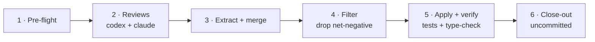

# 🔍 iso-review

> Review your **uncommitted working tree** with two agents at once — codex `/review` + claude `/code-review` — merge their findings, apply every fix that helps, verify, and stop uncommitted for your final read.

---

## 🧩 What It Does

Dual-agent review of the current working-tree diff, then applies the fixes worth keeping — never committing.

- 👥 **Two reviewers, two tabs** — codex and claude review the same diff in their own visible herdr tabs
- 🔀 **Merged + de-duplicated** — findings hitting the same spot fold into one (noting both reviewers raised it)
- ✅ **Keeps almost everything** — applies every fix except the net-negative ones (over-engineering, speculative "consider…" notes, coupling/churn for no real gain)
- 🧪 **Self-verifies** — a codex fix tab applies the fixes, then runs the repo's tests + type-check and reports
- 🛑 **Never commits** — leaves all changes in the working tree for your final read

---

## 🔄 Flow

The main session orchestrates; the review and fix tabs do the work. One review at a time per working tree — for parallel reviews, use separate git worktrees (each gets its own cwd-local `.iso/logs/review`).



`.iso/logs/review` is wiped clean at the start of each run, so no prior run's findings, transcripts, or accepted fixes leak in.

---

## ▶️ Trigger

```
/iso-review
```

Or ask: *"review and fix my uncommitted changes with codex + claude"*

`--max` raises the claude reviewer from `high` to `max`:

```
/iso-review --max
```

---

## ✅ Output

- 📄 `.iso/logs/review/review-codex.txt` + `review-claude.txt` — the raw reviewer findings (JSON)
- 📋 `.iso/logs/review/accepted-fixes.md` — the itemised fix instructions actually applied
- 🧾 An **accepted / dropped ledger** (each drop with a one-line reason) plus the fix tab's test + type-check report, printed in the session
- 🌳 Every fix left **uncommitted** in your working tree — you review and commit

---

## 🔧 Dependencies

| Tool | Role | Source |
|------|------|--------|
| [`iso-spawn`](../iso-spawn/) | Spawns + drives the codex/claude review and fix tabs | — |
| `herdr` | Terminal workspace manager the tabs live in | [herdr.dev](https://herdr.dev) |
| `codex` / `claude` | The reviewing + fixing agent CLIs | — |
| `git` | Reads the uncommitted working-tree diff | [git-scm.com](https://git-scm.com) |

> Requires running **inside a herdr pane** (`$HERDR_PANE_ID` must be set — inherited from [`iso-spawn`](../iso-spawn/)).

---

## 🔗 Related

- [`iso-spawn`](../iso-spawn/) — the spawn / deliver / recover engine iso-review is built on.
- [`iso-write`](../iso-write/) — build a plan with TDD; review the result here before committing.
- [`iso-plan`](../iso-plan/) — produce that plan first.
