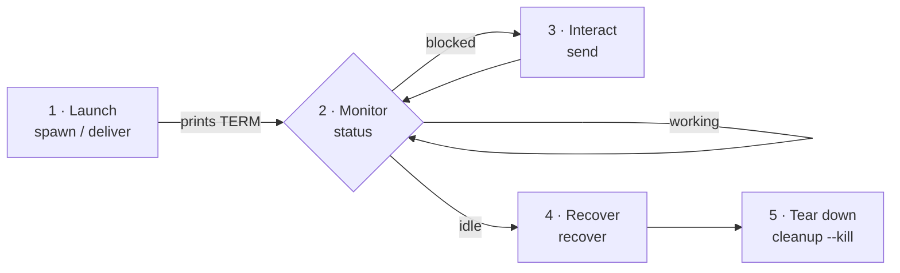

# 🚀 iso-spawn

> Spawn a `codex` or `claude` agent in its own [herdr](https://herdr.dev) tab, in the **same workspace** you're working in — full permissions, optional auto-running task, delivered in the background so you never block.

---

## 🧩 What It Does

Opens a fresh agent beside you and (optionally) hands it a task that auto-runs the moment it boots. The new agent lands in the **current** workspace — resolved from your pane, not from whatever happens to have UI focus — and starts in your current directory, not `~`.

You stay unblocked: the prompt is delivered by a detached worker. Add `--wait` if you'd rather block until the task finishes.

---

### Lifecycle

You are the orchestrator. A spawned agent runs on its own and never calls you back — you drive it through five phases, each with one verb, all keyed off the `TERM` printed at launch:



stdout is capturable (the bare `TERM`, or the recovered result for `deliver`); the human banner goes to stderr:

```bash
term=$(scripts/spawn.sh codex --prompt "Add a health-check endpoint")   # async → TERM handle
result=$(scripts/spawn.sh deliver codex --prompt "Summarise the repo")  # serial → answer
```

---

## ▶️ Trigger

```
/iso-spawn
```

Or ask: *"spawn codex"*, *"open a claude tab"*, *"dispatch this task to an agent beside me"*

```bash
# codex here, full perms, task auto-runs (returns immediately)
scripts/spawn.sh codex --prompt "Add a health-check endpoint"

# claude, full perms, no prompt
scripts/spawn.sh claude

# dispatch and BLOCK until done, then report status
scripts/spawn.sh codex --prompt "Run tests and fix failures" --wait

# spawn + wait + recover output + kill the tab in one call
scripts/spawn.sh deliver codex --prompt "Summarise the repo" --kill

# sandboxed, split the current tab, jump focus to it
scripts/spawn.sh codex --safe --split right --focus
```

---

### Defaults

| Default | Why | Opt out |
|---------|-----|---------|
| **Full permissions ON** | A dispatched agent should just work | `--safe` |
| **cwd = your pane's cwd** | Starts where you're working | `--cwd PATH` |
| **Background, no focus** | Spawns beside you without stealing focus | `--focus` |
| **One agent per call** | Predictable; fan-out = call again | — |

---

### Verbs & Options

**Verbs:** `spawn` (default bare alias), `deliver`, `send`, `recover`, `status`, `cleanup`

```bash
scripts/spawn.sh send    <TERM> "Follow-up instruction"  # send text to a live agent
scripts/spawn.sh status  <TERM>                          # idle|working|blocked|unknown
scripts/spawn.sh recover <TERM> --what chat              # read the full transcript
scripts/spawn.sh cleanup <TERM> --kill                   # kill tab + remove sidecar
scripts/spawn.sh cleanup --orphaned                      # reap all stale sidecars
```

| flag | meaning |
|------|---------|
| `<codex\|claude>` | required first arg of spawn/deliver |
| `--prompt TEXT` | inject + auto-run on boot (delivered async) |
| `--cwd PATH` | working dir (default: caller's pane cwd) |
| `--label TEXT` | tab label (default: agent type) |
| `--name TEXT` | name base; auto-suffixed if taken |
| `--safe` | disable full permissions |
| `--split right\|down` | split current tab instead of new tab |
| `--focus` | switch focus to the new tab |
| `--wait` | block until the agent finishes, then print status |
| `--recover [output\|chat]` | with `--wait`: after idle, print the agent's recovered output |
| `--what output\|chat` | (deliver) what to recover (default `output`) |
| `--kill` | after the action, close the tab and remove the sidecar (opt-in; not on bare async `spawn`) |

---

## ✅ Output

### Recover Output

After an agent finishes, pull its work back from its **native transcript** (codex/claude JSONL) — the clean final answer, or the full chat for debugging:

```bash
scripts/spawn.sh recover <TERM>              # clean final answer
scripts/spawn.sh recover <TERM> --what chat  # full transcript
scripts/spawn.sh codex --prompt "…" --wait --recover   # block, then print answer
scripts/spawn.sh deliver codex --prompt "…" --kill     # spawn + wait + recover + cleanup
```

Keyed off the `term` printed at spawn. A `.spawn` sidecar written at spawn maps `<TERM>` → the agent's transcript file (race-free: snapshot-diff → prompt fingerprint → newest-by-mtime). If unmappable, it falls back to herdr scrollback (bounded; may truncate long chats), flagged with a `# source: scrollback` header.

---

### Verify / Monitor

```bash
herdr agent list                                    # all agents + status
herdr agent get <term>                              # one agent's status
herdr agent wait <term> --status idle --timeout MS  # block on completion
```

Each spawn writes a `.spawn` sidecar to `<cwd>/.iso/logs/spawn/<date>__<agent>__<name>__<term>.spawn` — `[meta]` (TERM→transcript mapping, read by `--recover`) plus the delivery `[trace]`.

---

## 🔧 Dependencies

| Tool | Role | Source |
|------|------|--------|
| `herdr` | Terminal workspace manager — panes, tabs, agents | [herdr.dev](https://herdr.dev) |
| `codex` / `claude` | The agent CLIs being spawned | — |

> Requires running **inside a herdr pane** (`$HERDR_PANE_ID` must be set).

---

### More

- [SKILL.md](SKILL.md) — the agent-facing contract and the *why it's built this way* notes.
- [REFERENCE.md](REFERENCE.md) — herdr object model, status semantics, failure modes.

## 🔗 Related

- [`iso‑write`](../iso-write/) — give a spawned agent a plan to implement.
- [`iso‑plan`](../iso-plan/) — produce that plan first.
